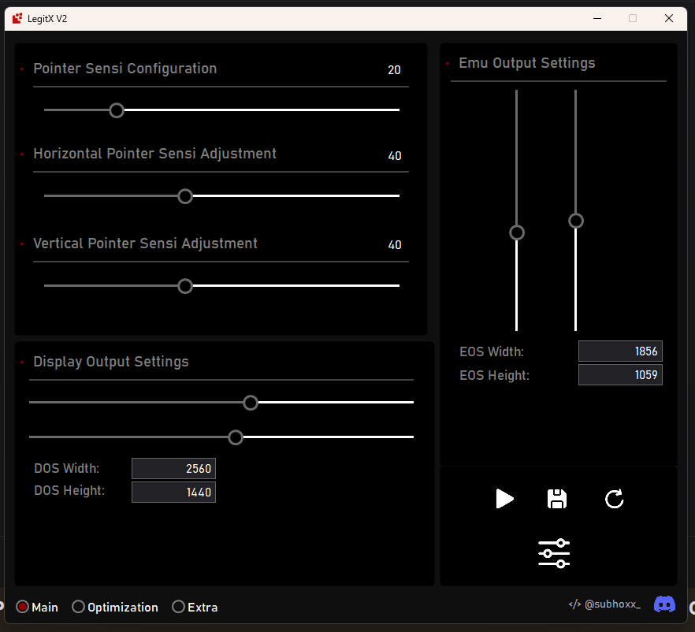

# LegitX V2

LegitX V2 is a Windows mouse sensitivity and input-tuning utility for gamers. It combines low-level mouse input, configurable sensitivity profiles, movement prediction, overlay controls, and optional Windows registry presets in a C# WinForms application targeting .NET Framework 4.8.1. The project is useful for people searching for an open-source Windows mouse smoother, anti-jitter tool, DPI and sensitivity profile manager, or emulator input optimizer.

The project is being prepared for transparent open-source development. The application does not contain a credential grabber, browser-password reader, cookie stealer, keylogger, webhook uploader, or background data exfiltration path in the reviewed source. The original code did contain anti-analysis checks, self-delete behavior, remote unsigned batch downloads, and forensic-log cleanup scripts. Those publication blockers were removed from this build. Read [the security review](docs/SECURITY.md) before distributing binaries.

## What it does

- Captures mouse input through Windows low-level hooks and applies configurable sensitivity processing.
- Uses movement prediction to smooth fast input changes and reduce jitter.
- Provides an always-on-top overlay and foreground-window awareness.
- Stores user preferences and applies optional registry presets after an explicit confirmation.
- Includes emulator, display, RAM, CPU, network, and driver controls where the underlying operation is visible and documented.
- Runs as a single Windows desktop process and requires administrator rights for system-wide registry and input changes.

## Screenshot



## What it does not do

LegitX V2 does not collect credentials, read browser stores, monitor clipboard contents, upload files, install persistence, or silently contact a licensing server. The remaining network actions are user-triggered links and availability checks for downloads shown in the UI. The application can change Windows settings and start documented system tools; review those actions before enabling an optimizer.

## Requirements

- Windows 10 or Windows 11 (x64 recommended).
- .NET Framework 4.8.1.
- Visual Studio 2022 with the .NET desktop workload, or MSBuild with the .NET Framework 4.8.1 targeting pack.

## Build

```powershell
dotnet msbuild "LegitX V2.csproj" /t:Build /p:Configuration=Release /v:minimal
```

The output is written to `bin\Release`. Build Debug when developing and Release when producing a reviewable artifact. Do not publish a binary until you have reviewed the exact source and embedded resources being built.

## Project layout

- `Application/` — application startup, prerequisite checks, and single-instance handling.
- `UI/` — the WinForms shell and generated designer code.
- `Hooks/` — Windows mouse-hook integration.
- `Input/` — sensitivity and movement processing.
- `Services/` — overlays, registry settings, and supporting services.
- `Resources/Embedded/` — reviewed registry presets and UI assets.
- `docs/` — architecture, build, security, and privacy documentation.

## Safety and privacy

The program can request elevation, install low-level input hooks, modify registry values, create a temporary firewall rule, run `regedit.exe` for a selected preset, and invoke selected Windows networking commands. These actions are visible in the source and should be tested in a disposable Windows account or virtual machine. See [SECURITY.md](docs/SECURITY.md) and [PRIVACY.md](docs/PRIVACY.md) for the complete data-flow description.

## Open-source status

This repository does not yet contain a license. Add a license before accepting contributions or distributing the code as open source; [OPEN_SOURCE_CHECKLIST.md](docs/OPEN_SOURCE_CHECKLIST.md) explains the remaining release steps. A license cannot be selected safely without the copyright holder's preference.

## Search and discoverability

For a repository listing, use accurate topics such as `windows`, `winforms`, `csharp`, `mouse-sensitivity`, `mouse-smoothing`, `gaming-tools`, `input-latency`, `dpi`, and `dotnet-framework`. Keep the description factual and link to the security review. Search ranking cannot be guaranteed, but clear terminology, useful documentation, releases, and links from related projects improve discoverability without keyword stuffing.

## Contributing

Please explain the user-visible effect of a change, document any Windows permission it needs, and include a build result. Security reports should follow [SECURITY.md](docs/SECURITY.md) rather than being posted publicly with working exploit details.

## Community

Join the [LegitX V2 Discord community](https://discord.gg/Vs9sM8cZw5) for discussion, troubleshooting, and release updates.
